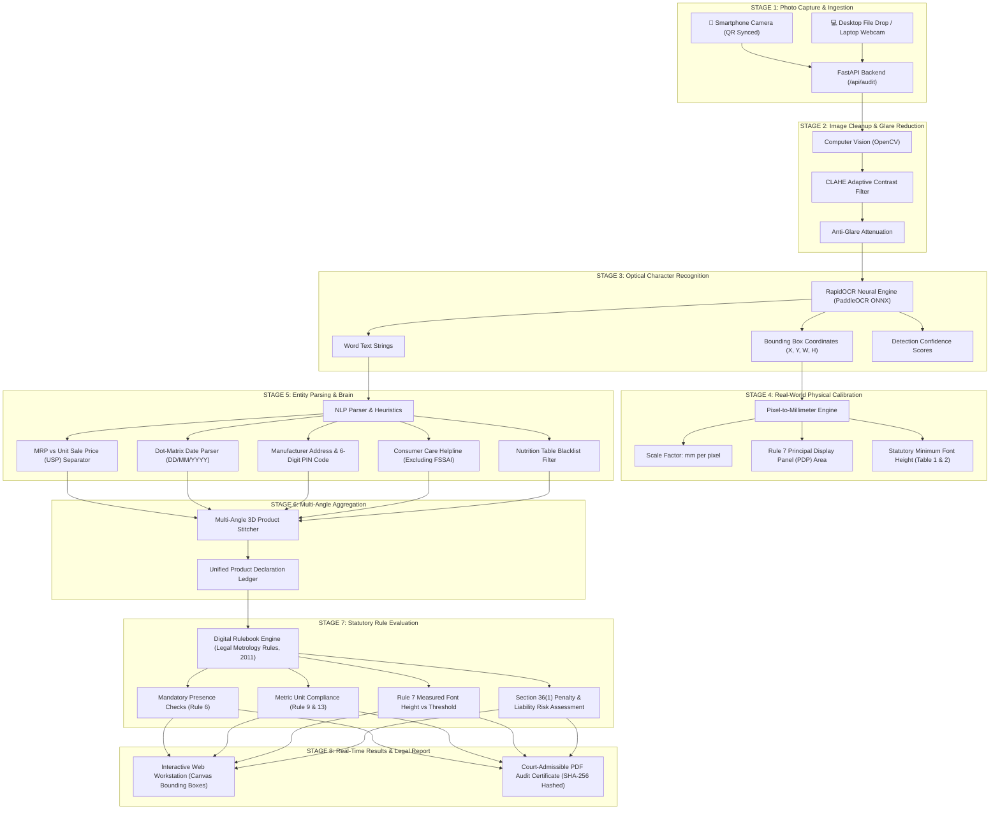

# 🧠 SYNX Technical System Explainer
### Step-by-Step Architecture, Engineering Pipeline & Jargon Buster
**Project**: Automated Legal Metrology (Packaged Commodities) Compliance Checker  
**Event**: Smart India Hackathon 2026 | **Problem ID**: 26034 | **Team**: SYNX  

---

## 🗺️ 1. The Big Picture: End-to-End Visual Workflow

---

## 🔬 2. Step-by-Step Breakdown with Jargon-Buster Explanations

Here is what happens at every millisecond of the audit, explained so simply that anyone can understand:

---

### 📥 STEP 1: Photo Capture & Ingestion
The system takes in photos of the product packaging. Because real products are 3D, inspectors photograph 2 to 4 angles (Front PDP, Back Panel, Cap/Neck Stamp).

#### 🤓 Jargon Buster:
- **REST API (FastAPI)**:
  - *What it is*: A standard digital highway where computers talk to each other.
  - *Simple Analogy*: Think of it like a waiter in a restaurant. Your phone gives an order (the photo) to the waiter (the REST API), who runs to the kitchen (our server) and brings back the cooked meal (the compliance verdict).
- **Session ID & Polling**:
  - *What it is*: How the phone pairs with the laptop without passwords.
  - *Simple Analogy*: When you scan the QR code, the laptop creates a private digital mailbox with a secret key (`session_id`). The phone drops photos into that mailbox, and the laptop checks the mailbox every second until the photos arrive.

---

### 🕶️ STEP 2: Image Preprocessing & Glare Reduction
Real-life potato chip packets, plastic bottles, and foil wrappers reflect light like mirrors. Ordinary cameras see giant white blinding glare spots that hide words.

#### 🤓 Jargon Buster:
- **Computer Vision (OpenCV)**:
  - *What it is*: Software that treats images as numbers so mathematical filters can change colors, sharpness, and brightness.
  - *Simple Analogy*: Giving eyes and glasses to computer software.
- **Specular Glare**:
  - *What it is*: Harsh shiny white reflections caused by store fluorescent lights hitting smooth plastic.
- **CLAHE (Contrast Limited Adaptive Histogram Equalization)**:
  - *What it is*: An algorithm that cuts an image into tiny tiles and automatically balances bright and dark areas locally.
  - *Simple Analogy*: Like wearing polarized sunglasses on a sunny beach. It cuts through the harsh shiny glare so you can read faint, washed-out printing underneath.

---

### 👁️ STEP 3: Spatial OCR (Reading Words and Locating Them)
The preprocessed image is fed into an optical character recognition model to read text and pinpoint where each word is located on the packaging.

#### 🤓 Jargon Buster:
- **OCR (Optical Character Recognition)**:
  - *What it is*: Technology that converts pictures of letters into real, selectable computer text.
- **PaddleOCR / RapidOCR & ONNX**:
  - *What it is*: A deep learning neural network trained on millions of real-world text images. We run it via ONNX (Open Neural Network Exchange).
  - *Simple Analogy*: An artificial brain that has learned what English letters look like, compressed into a lightweight file so it runs in less than 1 second on a normal laptop CPU without needing an expensive, hot gaming graphics card (GPU).
- **Bounding Boxes (BBoxes) & Polygons**:
  - *What it is*: Invisible digital rectangles or 4-corner outlines marking the exact pixel coordinates $(x, y, \text{width}, \text{height})$ of every word.
  - *Simple Analogy*: Putting a bright highlighter box around every word on a paper sheet.
- **Confidence Score (0.0 to 1.0)**:
  - *What it is*: How certain the AI is about its reading.
  - *Simple Analogy*: If the score is `0.98`, the AI is saying: *"I am 98% sure this word is 'PARLE'"*. If it is `0.45`, it means: *"This is a blurry smudge, proceed with caution."*

---

### 📏 STEP 4: Physical World Millimeter Calibration & Rule 7 Math
A smartphone screen only knows **pixels** (dots on a screen). But the law (Rule 7 of the Legal Metrology Rules) measures in **millimeters** ($\text{mm}$). We have to teach the computer how to convert pixels into real-world millimeters.

#### 🤓 Jargon Buster:
- **Pixel Scale Factor ($\text{mm/pixel}$)**:
  - *What it is*: The mathematical multiplier that says "In this photo, 10 pixels equals 1 millimeter".
  - *How we calculate it*: Either by entering the package width (e.g., $120\text{ mm}$ package covers $1200\text{ px}$, so scale is $0.1\text{ mm/px}$), or by placing a known reference object next to it (like a ₹5 coin which is legally exactly $23.0\text{ mm}$ in diameter).
- **Principal Display Panel (PDP)**:
  - *What it is*: The statutory legal name for the "front face" of the package that faces customers on store shelves.
  - *The Formula*:
    - Rectangular Box / Pouch: $\text{Area} = \text{Width} \times \text{Height}$
    - Cylindrical Bottle / Can: $\text{Area} = 40\% \times \text{Height} \times \pi \times \text{Diameter}$
- **Rule 7 Minimum Font Height Tiers**:
  - *What it is*: The Indian government statutory table dictating font size.
  - *Simple Table*:
    - If PDP area $\le 50\text{ cm}^2$ $\rightarrow$ Numbers must be $\ge 1.0\text{ mm}$ tall.
    - If PDP area is $50 \text{ to } 200\text{ cm}^2$ $\rightarrow$ Numbers must be $\ge 2.0\text{ mm}$ tall.
    - If PDP area is $200 \text{ to } 360\text{ cm}^2$ $\rightarrow$ Numbers must be $\ge 4.0\text{ mm}$ tall.
    - If PDP area $> 360\text{ cm}^2$ $\rightarrow$ Numbers must be $\ge 6.0\text{ mm}$ tall.
  - *How we check it*: We multiply the letter's pixel height by our scale factor. If measured height is $1.8\text{ mm}$ when the law requires $\ge 2.0\text{ mm}$, it triggers an immediate statutory violation!

---

### 🧠 STEP 5: Entity Parsing & NLP (The Detective Brain)
The OCR gives us a chaotic pile of 60 text snippets. The Entity Parser acts like a detective, figuring out which snippet is the price, which is the factory, and which is just marketing fluff.

#### 🤓 Jargon Buster:
- **NLP (Natural Language Processing)**:
  - *What it is*: Code that understands human grammar, sentence context, and terminology.
- **Regular Expressions (Regex)**:
  - *What it is*: Supercharged search patterns that hunt for specific text shapes.
  - *Examples*:
    - `\b[1-9][0-9]{5}\b` $\rightarrow$ Finds any 6-digit number that doesn't start with zero (an Indian postal PIN code!).
    - `(0[1-9]|1[0-2])[\/\-](20[2-9][0-9])` $\rightarrow$ Finds month and year dates like `12/2026`.
- **Nutrition Table Blacklist Filter**:
  - *The Problem*: Dumb OCR engines see `"Sugars: 14g"` and think the total pack weight is 14 grams, or see `"Energy: 100kJ"` and think the price is ₹100.
  - *Our Solution*: A semantic blacklist that detects nutrition tables and ignores them when looking for product weight or price.
- **MRP vs USP (Unit Sale Price) Disambiguation**:
  - *The Problem*: A bottle neck says `Rs. 30.00` and `Rs. 0.075/ml`. Dumb software picks `Rs. 0.075` as the product price!
  - *Our Solution*: Our engine checks for denominators (`/ml`, `/g`, `per unit`). It correctly categorizes `Rs. 0.075/ml` as the Unit Sale Price and `Rs. 30.00` as the Maximum Retail Price.
- **FSSAI License Disambiguation**:
  - *The Problem*: FSSAI food license numbers are 14 digits long (e.g., `Lic.No.1001202600060`). Standard phone parsers mistake them for a telephone number!
  - *Our Solution*: Strict exclusion logic that identifies FSSAI prefixes and 14-digit patterns, routing them away from customer care helplines.

---

### 🔄 STEP 6: Multi-Angle 3D Aggregation
Real products are 3-dimensional. A juice bottle has:
- **Angle 1 (Front)**: Brand Name & Net Volume (`400ml`)
- **Angle 2 (Back)**: Manufacturer Address & Customer Care
- **Angle 3 (Neck / Cap)**: Dot-matrix stamped MRP (`Rs. 30.00`), Date (`12/2026`), and Unit Sale Price

#### 🤓 Jargon Buster:
- **Multi-Angle Aggregator**:
  - *What it is*: An algorithmic combiner.
  - *How it works*: It runs OCR on each photo separately, tags every extraction with its origin (e.g. `source_angle: "Angle 2 (Back Panel)"`), and merges them into one complete product profile. If Front has weight and Back has factory address, the product passes both rules!

---

### ⚖️ STEP 7: Statutory Rule Evaluation & Penalty Engine
Now that all declarations are assembled, the engine runs them against the digitized rulebook.

#### 🤓 Jargon Buster:
- **Digital Statutory Rulebook (`legal_metrology_2011.json`)**:
  - *What it is*: A version-controlled JSON file where every clause of Indian law is digitized into structured logic rules.
  - *Why this is awesome*: If Parliament changes a rule or raises a fine tomorrow, lawyers or administrators can edit the JSON file directly in their web browser with live hot-reloading — zero lines of Python code need to be changed!
- **Section 36(1) Penalty Risk Assessment**:
  - *What it is*: The legal punishment engine under the Legal Metrology Act, 2009.
  - *The Fines*:
    - 1st Offence: Fine up to ₹25,000 per violation.
    - 2nd Offence: Fine up to ₹50,000.
    - Subsequent Offences: Fine up to ₹1,00,000 or up to 1 year imprisonment, or both.

---

### 📄 STEP 8: Real-Time Workstation & Certified PDF Generation
The findings are displayed live on the dashboard and compiled into an official PDF document.

#### 🤓 Jargon Buster:
- **Spatial Canvas Overlay**:
  - *What it is*: An interactive HTML5 viewport where users can see the scanned photo with color-coded bounding boxes on top:
    - 🟢 **Green**: Legally compliant declaration
    - 🔴 **Red**: Illegal violation
    - 🟡 **Amber**: Statutory warning
    - 🔵 **Cyan**: Detected background text
  - Clicking **Angle Tabs** (`[ Angle 1 ] [ Angle 2 ]`) swaps the view to inspect any side.
- **SHA-256 Cryptographic Evidence Hash**:
  - *What it is*: A 64-character mathematical fingerprint of the uploaded packaging photograph.
  - *Why it matters in court*: Under Section 65B of the Indian Evidence Act, digital evidence must be untampered. If anyone edits the photo in Photoshop by even 1 pixel, the SHA-256 hash completely changes. The hash printed on our certificate proves the image is original and admissible in a court of law.
- **ReportLab PDF Generator**:
  - *What it is*: A programmatic document engine that generates clean, signed, official Legal Metrology Compliance Audit Certificates in 0.2 seconds.

---

## 📊 Summary Table for Presentations

| Stage | Input | Technical Component | Plain English Job |
|---|---|---|---|
| **1. Ingestion** | Smartphone or Laptop Camera | FastAPI REST API | Gets photos into the computer without installing apps |
| **2. Clean Up** | Raw Packaging Photos | OpenCV + CLAHE | Removes light reflections & glare from shiny plastic |
| **3. Read Text** | Cleaned Image | RapidOCR (PaddleOCR ONNX) | Reads every word and records its pixel location |
| **4. Calibration** | Known Dimensions / Coin | Mathematical Scale Engine | Converts screen pixels into real millimeters |
| **5. Understand** | Raw Text Snippets | NLP Entity Parser + Regex | Figures out which word is MRP, Date, Factory, or Weight |
| **6. 3D Combine** | Photos of Multiple Sides | Multi-Angle Aggregator | Stitches Front, Back, and Cap into one complete product |
| **7. Judge** | Combined Declarations | Rules Engine + JSON Rulebook | Checks if the product breaks Indian laws and computes fines |
| **8. Certify** | Verdict & Bounding Boxes | HTML5 Canvas + ReportLab PDF | Draws colored boxes on screen & prints official court PDF |

---

*Authored by Team SYNX | Smart India Hackathon 2026*
